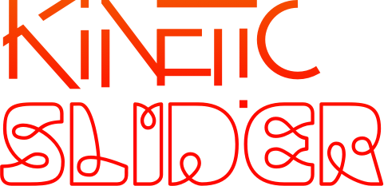

# KineticSlider


A high-performance, WebGL-powered slider component using PIXI.js for stunning visual effects and smooth transitions. Features displacement effects, pixi filters, animations, and more - all optimized for modern web applications with React support.

[](https://www.npmjs.com/package/kinetic-slider)
[](https://github.com/zachatkinson/kineticslider/blob/main/LICENSE)

## Features

- WebGL-powered rendering with PIXI.js
- Advanced displacement effects for interactive cursor and transitions
- Customizable filters for both images and text
- Touch swipe and mouse drag support
- Keyboard navigation support
- Optimized performance with texture atlas support
- Responsive design
- TypeScript support

## Installation

```bash
npm install kinetic-slider
# or
yarn add kinetic-slider
```

## Browser Support

KineticSlider is built with modern web standards and supports all major browsers:

- Chrome 90+
- Firefox 88+
- Safari 14+
- Edge 90+
- Opera 76+

For older browsers, consider using a polyfill for WebGL support.

## Examples

### Basic Slider with Text
```jsx
<KineticSlider
    images={['slide1.jpg', 'slide2.jpg']}
    texts={[['Welcome', 'Start your journey'], ['Features', 'Discover our capabilities']]}
/>
```

### Advanced Effects
```jsx
<KineticSlider
    images={images}
    texts={texts}
    cursorImgEffect={true}
    cursorTextEffect={true}
    imageFilters={[
        { type: 'bloom', intensity: 0.5 },
        { type: 'colorOverlay', color: '#ff0000', alpha: 0.2 }
    ]}
    textFilters={[
        { type: 'glow', intensity: 0.8, color: '#ffffff' }
    ]}
/>
```

### Custom Navigation
```jsx
<KineticSlider
    images={images}
    texts={texts}
    externalNav={true}
    navElement={{
        prev: '#custom-prev',
        next: '#custom-next'
    }}
/>
```

### Performance Optimized
```jsx
<KineticSlider
    images={images}
    texts={texts}
    useSlidesAtlas={true}
    slidesAtlas="slides-atlas"
    enableFilterBatching={true}
    filterBatchConfig={{
        bufferMs: 16,
        maxBatchSize: 10
    }}
/>
```

### Accessibility Focused
```jsx
<KineticSlider
    images={images}
    texts={texts}
    enableKeyboardNav={true}
    enableAria={true}
    ariaLabels={{
        prevButton: 'Previous slide',
        nextButton: 'Next slide',
        slide: 'Slide {current} of {total}'
    }}
/>
```

## Performance Tips

1. **Image Optimization**
    - Use WebP format for better compression
    - Optimize image dimensions to match display size
    - Consider using responsive images
    - Use texture atlases for multiple images

2. **Filter Usage**
    - Enable filter batching for multiple filters
    - Use appropriate filter intensities
    - Consider disabling complex filters on mobile
    - Use shader pooling for better performance

3. **Memory Management**
    - Clean up resources when component unmounts
    - Use appropriate texture atlas sizes
    - Monitor memory usage with large datasets
    - Consider lazy loading for large images

4. **Animation Performance**
    - Use appropriate transition durations
    - Enable hardware acceleration
    - Monitor frame rates during transitions
    - Consider reducing effects on lower-end devices

## Common Issues

### Performance Issues
1. **Slow Transitions**
   ```jsx
   // Reduce filter complexity
   <KineticSlider
       imageFilters={[
           { type: 'blur', intensity: 0.3 } // Reduced from 0.5
       ]}
       transitionDuration={300} // Faster transition
   />
   ```

2. **High Memory Usage**
   ```jsx
   // Enable texture atlases and limit cache
   <KineticSlider
       useSlidesAtlas={true}
       maxShaderCacheSize={50}
       enableShaderPooling={true}
   />
   ```

### Visual Issues
1. **Text Rendering**
   ```jsx
   // Adjust text settings
   <KineticSlider
       textTitleSize={48} // Reduced from 64
       textSubTitleSize={18} // Reduced from 24
   />
   ```

2. **Filter Artifacts**
   ```jsx
   // Adjust filter settings
   <KineticSlider
       imageFilters={[
           { 
               type: 'bloom',
               intensity: 0.3,
               quality: 0.5
           }
       ]}
   />
   ```

### Browser Compatibility
1. **WebGL Support**
   ```jsx
   // Add fallback for WebGL
   <KineticSlider
       fallbackRenderer="canvas" // Falls back to canvas if WebGL not available
   />
   ```

2. **Touch Events**
   ```jsx
   // Improve touch handling
   <KineticSlider
       touchSensitivity={0.5} // Adjust touch sensitivity
       enableTouchGestures={true}
   />
   ```

## Usage

```jsx
import React from 'react';
import { KineticSlider } from 'kinetic-slider';
import 'kinetic-slider/dist/styles.css'; // If using the extracted CSS

const MySlider = () => {
    const images = [
        '/images/slide1.jpg',
        '/images/slide2.jpg',
        '/images/slide3.jpg',
    ];

    const texts = [
        ['Title 1', 'Subtitle for slide 1'],
        ['Title 2', 'Subtitle for slide 2'],
        ['Title 3', 'Subtitle for slide 3'],
    ];

    return (
        <KineticSlider
            images={images}
            texts={texts}
            cursorImgEffect={true}
            cursorTextEffect={true}
            cursorScaleIntensity={0.65}
            cursorMomentum={0.14}
        />
    );
};

export default MySlider;
```

## Configuration Options

The KineticSlider component accepts a wide range of configuration options to customize its behavior and appearance. Here's a complete reference of all available options:

### Content Sources
```jsx
{
    // Array of image URLs or paths
    images: string[],
    
    // Array of text arrays, each containing [title, subtitle]
    texts: [string, string][],
    
    // Base path for all slide images (optional)
    slidesBasePath: string,
}
```

### Displacement Settings
```jsx
{
    // Path to the background displacement texture
    backgroundDisplacementSpriteLocation: string,
    
    // Path to the cursor displacement texture
    cursorDisplacementSpriteLocation: string,
    
    // Enable displacement effect on images
    cursorImgEffect: boolean,
    
    // Enable displacement effect on text
    cursorTextEffect: boolean,
    
    // Intensity of the cursor scale effect (0-1)
    cursorScaleIntensity: number,
    
    // Momentum of the cursor effect (0-1)
    cursorMomentum: number,
}
```

### Text Styling
```jsx
{
    // Title text color
    textTitleColor: string,
    
    // Title text size in pixels
    textTitleSize: number,
    
    // Title text letter spacing in pixels
    textTitleLetterspacing: number,
    
    // Subtitle text color
    textSubTitleColor: string,
    
    // Subtitle text size in pixels
    textSubTitleSize: number,
    
    // Subtitle text letter spacing in pixels
    textSubTitleLetterspacing: number,
}
```

### Navigation Settings
```jsx
{
    // Whether to use external navigation elements
    externalNav: boolean,
    
    // Selectors for external navigation elements
    navElement: {
        prev: string,  // CSS selector for previous button
        next: string   // CSS selector for next button
    },
}
```

### Texture Atlas Settings
```jsx
{
    // Enable texture atlas for slides
    useSlidesAtlas: boolean,
    
    // Name of the slides texture atlas
    slidesAtlas: string,
    
    // Enable texture atlas for effects
    useEffectsAtlas: boolean,
    
    // Name of the effects texture atlas
    effectsAtlas: string,
}
```

### Filter Settings
```jsx
{
    // Array of filters to apply to images
    imageFilters: FilterConfig[],
    
    // Array of filters to apply to text
    textFilters: FilterConfig[],
}
```

### Performance Settings
```jsx
{
    // Whether to enable filter batching for better performance
    enableFilterBatching: boolean,
    
    // Configuration for filter batching
    filterBatchConfig: {
        bufferMs: number,        // How long to wait before applying updates
        maxBatchSize: number     // Maximum number of updates to process
    },
    
    // Whether to enable shader pooling
    enableShaderPooling: boolean,
    
    // Maximum size of the shader cache
    maxShaderCacheSize: number,
}
```

### Animation Settings
```jsx
{
    // Duration of slide transitions in milliseconds
    transitionDuration: number,
    
    // Easing function for transitions
    transitionEasing: string,
    
    // Whether to enable automatic transitions
    autoPlay: boolean,
    
    // Delay between automatic transitions in milliseconds
    autoPlayDelay: number,
}
```

### Accessibility Settings
```jsx
{
    // Whether to enable keyboard navigation
    enableKeyboardNav: boolean,
    
    // Whether to enable ARIA attributes
    enableAria: boolean,
    
    // Custom ARIA labels
    ariaLabels: {
        prevButton: string,
        nextButton: string,
        slide: string
    },
}
```

### Debug Settings
```jsx
{
    // Whether to enable debug mode
    debug: boolean,
    
    // Whether to show performance metrics
    showPerformanceMetrics: boolean,
    
    // Whether to log filter operations
    logFilterOperations: boolean,
}
```

## Advanced Configuration

The KineticSlider component accepts many configuration options:

```jsx
<KineticSlider
    // Content sources
    images={['slide1.jpg', 'slide2.jpg']}
    texts={[['Title 1', 'Subtitle 1'], ['Title 2', 'Subtitle 2']]}
    slidesBasePath="/images/"

    // Displacement settings
    backgroundDisplacementSpriteLocation="/images/background-displace.jpg"
    cursorDisplacementSpriteLocation="/images/cursor-displace.png"
    cursorImgEffect={true}
    cursorTextEffect={true}
    cursorScaleIntensity={0.65}
    cursorMomentum={0.14}

    // Text styling
    textTitleColor="white"
    textTitleSize={64}
    textTitleLetterspacing={2}
    textSubTitleColor="white"
    textSubTitleSize={24}
    textSubTitleLetterspacing={1}

    // Navigation settings
    externalNav={false}
    navElement={{ prev: '.main-nav.prev', next: '.main-nav.next' }}

    // Custom filters
    imageFilters={[
        { type: 'displacement', intensity: 0.1 },
        { type: 'blur', intensity: 0.5 }
    ]}
    textFilters={[
        { type: 'glow', intensity: 0.8 }
    ]}
/>
```

## Available Filters

The KineticSlider component supports a wide variety of WebGL-powered filters. Each filter can be configured with an intensity value (0-1) and additional specific options. Here's a complete alphabetical list of available filters:

### Adjustment Filter
Adjusts brightness, contrast, saturation, and gamma.
```jsx
{
    type: 'adjustment',
    intensity: 1,
    brightness: 0,    // -1 to 1
    contrast: 0,      // -1 to 1
    saturation: 0,    // -1 to 1
    gamma: 0          // -1 to 1
}
```

### Advanced Bloom Filter
Applies a high-quality bloom effect with advanced controls.
```jsx
{
    type: 'advancedBloom',
    intensity: 1,
    bloomScale: 1.0,    // Bloom strength
    blur: 2,            // Blur strength
    brightness: 1.0,    // Bloom brightness
    threshold: 0.5      // Brightness threshold (0-1)
}
```

### Alpha Filter
Controls the alpha/opacity of the element.
```jsx
{
    type: 'alpha',
    intensity: 1,
    alpha: 1.0  // 0 to 1
}
```

### ASCII Filter
Converts the image to ASCII art.
```jsx
{
    type: 'ascii',
    intensity: 1,
    size: 8  // Size of ASCII characters
}
```

### Backdrop Blur Filter
Applies a Gaussian blur to everything behind the element.
```jsx
{
    type: 'backdropBlur',
    intensity: 1,
    strength: 10,     // Blur strength (0-100)
    quality: 5,       // Quality of blur
    kernelSize: 5     // Size of blur kernel (5,7,9,11,13,15)
}
```

### Bevel Filter
Creates a beveled edge effect.
```jsx
{
    type: 'bevel',
    intensity: 1,
    rotation: 45,     // Rotation angle
    thickness: 2      // Edge thickness
}
```

### Bloom Filter
Applies a simple bloom/glow effect.
```jsx
{
    type: 'bloom',
    intensity: 1,
    strength: 5,      // Overall strength
    strengthX: 5,     // Horizontal strength
    strengthY: 5      // Vertical strength
}
```

### Blur Filter
Applies a Gaussian blur effect.
```jsx
{
    type: 'blur',
    intensity: 1,
    strength: 5,      // Overall strength
    quality: 5,       // Quality of blur
    kernelSize: 5     // Size of blur kernel (5,7,9,11,13,15)
}
```

### Bulge Pinch Filter
Creates a bulge or pinch distortion effect.
```jsx
{
    type: 'bulgePinch',
    intensity: 1,
    radius: 100,      // Radius of effect
    strength: 1       // Strength of effect (-1 to 1)
}
```

### Color Gradient Filter
Applies a color gradient overlay.
```jsx
{
    type: 'colorGradient',
    intensity: 1,
    color1: '#ff0000',
    color2: '#00ff00',
    angle: 45         // Gradient angle
}
```

### Color Map Filter
Applies a color mapping effect using a texture.
```jsx
{
    type: 'colorMap',
    intensity: 1,
    colorMap: 'path/to/colormap.png',
    mix: 0.5          // Mix ratio (0-1)
}
```

### Color Matrix Filter
Applies a color matrix transformation.
```jsx
{
    type: 'colorMatrix',
    intensity: 1,
    matrix: [1,0,0,0,0, 0,1,0,0,0, 0,0,1,0,0, 0,0,0,1,0]  // 4x5 matrix
}
```

### Color Overlay Filter
Applies a solid color overlay.
```jsx
{
    type: 'colorOverlay',
    intensity: 1,
    color: '#ff0000',
    alpha: 0.5        // Overlay opacity (0-1)
}
```

### Color Replace Filter
Replaces a specific color with another.
```jsx
{
    type: 'colorReplace',
    intensity: 1,
    originalColor: '#ff0000',
    newColor: '#00ff00',
    tolerance: 0.1    // Color matching tolerance (0-1)
}
```

### Convolution Filter
Applies a custom convolution matrix.
```jsx
{
    type: 'convolution',
    intensity: 1,
    matrix: [0,1,0, 1,1,1, 0,1,0],  // 3x3 matrix
    bias: 0                          // Bias value
}
```

### Cross Hatch Filter
Applies a cross-hatching effect.
```jsx
{
    type: 'crossHatch',
    intensity: 1,
    lineWidth: 1,     // Width of lines
    lineSpacing: 5    // Space between lines
}
```

### CRT Filter
Simulates a CRT monitor effect.
```jsx
{
    type: 'crt',
    intensity: 1,
    curvature: 0.5,   // Screen curvature (0-1)
    lineWidth: 1,     // Scan line width
    lineContrast: 0.5 // Line contrast (0-1)
}
```

### Dot Filter
Applies a halftone dot effect.
```jsx
{
    type: 'dot',
    intensity: 1,
    angle: 5,         // Angle of dots
    scale: 1,         // Scale of effect
    grayscale: true   // Whether to use grayscale
}
```

### Drop Shadow Filter
Applies a drop shadow effect.
```jsx
{
    type: 'dropShadow',
    intensity: 1,
    alpha: 0.5,       // Shadow opacity
    blur: 4,          // Shadow blur
    color: '#000000', // Shadow color
    distance: 5,      // Shadow distance
    rotation: 45      // Shadow angle
}
```

### Emboss Filter
Creates an embossed effect.
```jsx
{
    type: 'emboss',
    intensity: 1,
    strength: 5       // Emboss strength
}
```

### Glitch Filter
Applies a glitch/distortion effect.
```jsx
{
    type: 'glitch',
    intensity: 1,
    offset: 10,       // Offset amount
    slices: 10        // Number of slices
}
```

### Glow Filter
Applies a simple glow effect.
```jsx
{
    type: 'glow',
    intensity: 1,
    distance: 15,     // Glow distance
    outerStrength: 4, // Outer glow strength
    innerStrength: 0, // Inner glow strength
    color: '#ffffff', // Glow color
    quality: 0.5      // Quality of effect
}
```

### Godray Filter
Creates a light ray effect.
```jsx
{
    type: 'godray',
    intensity: 1,
    angle: 30,        // Ray angle
    gain: 0.5,        // Light gain
    lacunarity: 2.0,  // Lacunarity
    time: 0           // Animation time
}
```

### Grayscale Filter
Converts the image to grayscale.
```jsx
{
    type: 'grayscale',
    intensity: 1
}
```

### HSL Adjustment Filter
Adjusts hue, saturation, and lightness.
```jsx
{
    type: 'hsl',
    intensity: 1,
    hue: 0,           // Hue rotation (-180 to 180)
    saturation: 0,    // Saturation adjustment (-1 to 1)
    lightness: 0      // Lightness adjustment (-1 to 1)
}
```

### Kawase Blur Filter
Applies a Kawase blur effect.
```jsx
{
    type: 'kawaseBlur',
    intensity: 1,
    blur: 4,          // Blur amount
    quality: 3        // Quality of blur
}
```

### Motion Blur Filter
Applies a motion blur effect.
```jsx
{
    type: 'motionBlur',
    intensity: 1,
    velocity: 20,     // Blur velocity
    kernelSize: 5,    // Size of blur kernel
    offset: 0         // Offset amount
}
```

### Multi Color Replace Filter
Replaces multiple colors at once.
```jsx
{
    type: 'multiColorReplace',
    intensity: 1,
    replacements: [   // Array of [originalColor, newColor] pairs
        ['#ff0000', '#00ff00'],
        ['#0000ff', '#ffff00']
    ],
    tolerance: 0.05   // Color matching tolerance (0-1)
}
```

### Noise Filter
Applies random noise to the image.
```jsx
{
    type: 'noise',
    intensity: 1,
    noiseLevel: 0.5,  // Amount of noise (0-1)
    seed: 0           // Random seed
}
```

### Old Film Filter
Simulates old film effects.
```jsx
{
    type: 'oldFilm',
    intensity: 1,
    noise: 0.3,       // Noise intensity
    noiseSize: 1,     // Noise size
    scratch: 0.5,     // Scratch frequency
    scratchDensity: 0.3, // Scratch density
    scratchWidth: 1,  // Scratch width
    sepia: 0.3,       // Sepia intensity
    vignetting: 0.3   // Vignette intensity
}
```

### Outline Filter
Creates an outline effect.
```jsx
{
    type: 'outline',
    intensity: 1,
    thickness: 1,     // Outline thickness
    color: '#000000', // Outline color
    quality: 0.5      // Quality of effect
}
```

### Pixelate Filter
Applies a pixelation effect.
```jsx
{
    type: 'pixelate',
    intensity: 1,
    size: 10,         // Pixel size
    sizeX: 10,        // Horizontal pixel size
    sizeY: 10         // Vertical pixel size
}
```

### Radial Blur Filter
Applies a radial blur effect.
```jsx
{
    type: 'radialBlur',
    intensity: 1,
    angle: 30,        // Blur angle
    center: [0.5, 0.5] // Center point [x, y]
}
```

### Reflection Filter
Creates a reflection effect.
```jsx
{
    type: 'reflection',
    intensity: 1,
    boundary: 0.5,    // Reflection boundary (0-1)
    amplitude: 20,    // Wave amplitude
    waveLength: 30,   // Wave length
    alpha: 0.5,       // Reflection opacity
    time: 0           // Animation time
}
```

### RGB Split Filter
Splits the RGB channels.
```jsx
{
    type: 'rgbSplit',
    intensity: 1,
    red: [0, 0],      // Red channel offset [x, y]
    green: [0, 0],    // Green channel offset [x, y]
    blue: [0, 0]      // Blue channel offset [x, y]
}
```

### Shockwave Filter
Creates a shockwave effect.
```jsx
{
    type: 'shockwave',
    intensity: 1,
    center: [0.5, 0.5], // Center point [x, y]
    radius: 100,        // Wave radius
    wavelength: 30,     // Wave length
    amplitude: 30,      // Wave amplitude
    speed: 500          // Wave speed
}
```

### Simple Lightmap Filter
Applies a lightmap overlay.
```jsx
{
    type: 'simpleLightmap',
    intensity: 1,
    lightMap: 'path/to/lightmap.png',
    alpha: 0.5         // Overlay opacity (0-1)
}
```

### Simplex Noise Filter
Applies simplex noise.
```jsx
{
    type: 'simplexNoise',
    intensity: 1,
    scale: 100,        // Noise scale
    octaves: 3,        // Number of octaves
    persistence: 0.5,  // Persistence
    lacunarity: 2.0,   // Lacunarity
    baseFrequency: 1.0 // Base frequency
}
```

### Tilt Shift Filter
Applies a tilt-shift effect.
```jsx
{
    type: 'tiltShift',
    intensity: 1,
    blur: 100,         // Blur amount
    gradientBlur: 600, // Gradient blur
    start: 0.2,        // Start point (0-1)
    end: 0.8           // End point (0-1)
}
```

### Twist Filter
Applies a twist distortion effect.
```jsx
{
    type: 'twist',
    intensity: 1,
    angle: 5,          // Twist angle
    radius: 100        // Effect radius
}
```

### Zoom Blur Filter
Applies a zoom blur effect.
```jsx
{
    type: 'zoomBlur',
    intensity: 1,
    strength: 0.1,     // Blur strength
    center: [0.5, 0.5] // Center point [x, y]
}
```

## Using Texture Atlases

Texture atlases are a powerful optimization technique that combines multiple images into a single texture, reducing the number of draw calls and improving performance. KineticSlider supports texture atlases for both slides and effects.

### Benefits
- Reduced number of WebGL draw calls
- Faster loading times
- Lower memory usage
- Better performance on mobile devices
- Smoother animations and transitions

### Implementation

```jsx
<KineticSlider
    // Enable texture atlases
    useSlidesAtlas={true}
    slidesAtlas="slides-atlas"
    useEffectsAtlas={true}
    effectsAtlas="effects-atlas"
    
    // Other props remain the same
    images={images}
    texts={texts}
/>
```

### Generating Texture Atlases

The package includes a utility script to generate texture atlases from your slide images:

```bash
# Basic usage
node src/scripts/generateAtlas.cjs --input=public/images/slides --name=slides-atlas

# Advanced options
node src/scripts/generateAtlas.cjs \
    --input=public/images/slides \
    --name=slides-atlas \
    --padding=2 \
    --max-width=2048 \
    --max-height=2048 \
    --format=json
```

#### Atlas Generation Options
- `--input`: Directory containing your slide images
- `--name`: Name for the generated atlas
- `--padding`: Padding between images (default: 2)
- `--max-width`: Maximum atlas width (default: 2048)
- `--max-height`: Maximum atlas height (default: 2048)
- `--format`: Output format (json/png, default: json)

### Best Practices
1. **Image Preparation**
    - Use consistent image sizes
    - Optimize images before creating the atlas
    - Consider using WebP format for better compression

2. **Atlas Size**
    - Keep atlas dimensions under 2048x2048 for best compatibility
    - Split into multiple atlases if needed
    - Consider device capabilities when setting max dimensions

3. **Performance**
    - Monitor memory usage with large atlases
    - Use the `enableShaderPooling` option for better performance
    - Consider lazy loading for large atlases

4. **Development Workflow**
    - Generate atlases during build process
    - Keep source images separate from generated atlases
    - Version control both source images and generated atlases

### Troubleshooting

If you experience issues with texture atlases:

1. **Memory Issues**
   ```jsx
   // Reduce atlas size
   <KineticSlider
       useSlidesAtlas={true}
       slidesAtlas="slides-atlas"
       maxShaderCacheSize={100} // Limit shader cache
   />
   ```

2. **Loading Performance**
   ```jsx
   // Enable lazy loading
   <KineticSlider
       useSlidesAtlas={true}
       slidesAtlas="slides-atlas"
       enableShaderPooling={true}
   />
   ```

3. **Visual Artifacts**
    - Check padding settings in atlas generation
    - Verify image dimensions are consistent
    - Ensure proper image format support

## Automated Releases

This project uses [semantic-release](https://github.com/semantic-release/semantic-release) for automated versioning and releases. When you push commits to the main branch, GitHub Actions will automatically:

1. Run tests and linting
2. Determine the version bump based on conventional commit messages
3. Update the package.json version
4. Generate a changelog
5. Create a GitHub release
6. Publish to npm

### Commit Message Format

We follow the [Conventional Commits](https://www.conventionalcommits.org/) specification:

- `feat: add new feature` - Minor version bump (1.0.0 → 1.1.0)
- `fix: resolve issue` - Patch version bump (1.0.0 → 1.0.1)
- `feat!: breaking change` - Major version bump (1.0.0 → 2.0.0)

See the [COMMIT_CONVENTION.md](./COMMIT_CONVENTION.md) file for more details.

## API Reference

See [our documentation](https://github.com/zachatkinson/kineticslider) for a complete API reference.

## License

Apache 2.0 © [Creative Branding](https://creativebranding.ca)

---

## Development Status

Test suite is currently under maintenance as we migrate to ESM (ECMAScript Modules) format. Tests are allowed to fail in CI pipelines without blocking builds. Key known issues being addressed:

- ResourceManager test has type compatibility issues with class methods
- FilterFactory test has module resolution issues
- Environment variable handling needs improvement for test environments

These issues will be fixed in upcoming releases.

## Development

When installing dependencies for development, use the following command to avoid peer dependency conflicts:

```bash
npm run dev:install
# or directly:
npm install --legacy-peer-deps
```

This is necessary because the library supports multiple React versions (17-19) but development tools may have strict version requirements.

