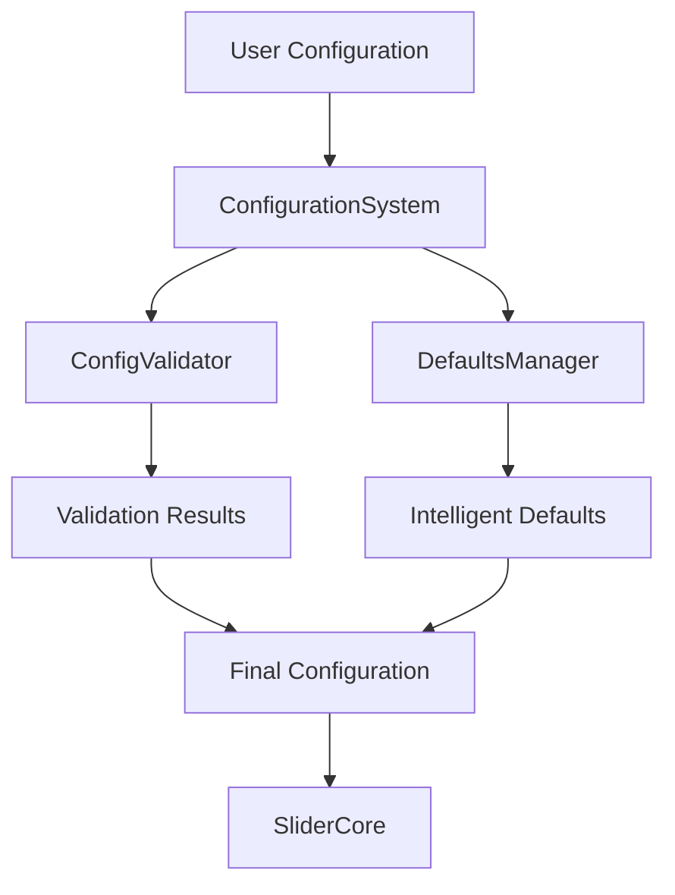

# KineticSlider Configuration Guide

An interactive guide to configuring and customizing your KineticSlider component with comprehensive examples, best practices, and troubleshooting tips.

## Table of Contents

1. [Configuration System Overview](#configuration-system-overview)
2. [Quick Start Guide](#quick-start-guide)
3. [Basic Configuration Examples](#basic-configuration-examples)
4. [Advanced Configuration Options](#advanced-configuration-options)
5. [Interactive Configuration Builder](#interactive-configuration-builder)
6. [Responsive Configuration Guide](#responsive-configuration-guide)
7. [Performance Optimization](#performance-optimization)
8. [Accessibility Configuration](#accessibility-configuration)
9. [Migration Guide](#migration-guide)
10. [Troubleshooting & Validation](#troubleshooting--validation)
11. [API Reference](#api-reference)

---

## Configuration System Overview

The KineticSlider configuration system is built with a robust, three-tier architecture designed for type safety, intelligent defaults, and comprehensive validation.

### Architecture Components



#### 1. **Type Definitions** (`SliderConfig`)
- Comprehensive TypeScript interfaces with full IntelliSense support
- Hierarchical structure supporting nested configurations
- Optional properties with sensible defaults

#### 2. **Configuration Validation** (`ConfigValidator`)
- Runtime validation with detailed error reporting
- Performance warnings and best practice suggestions
- Path-based error tracking for precise debugging

#### 3. **Defaults Management** (`DefaultsManager`)
- Context-aware intelligent defaults
- Responsive defaults with breakpoint support
- Smart merging algorithms that preserve user preferences

#### 4. **Configuration System** (`ConfigurationSystem`)
- Unified API: `processConfig(userConfig)`
- Combines validation and defaults application
- Handles legacy configuration migration

### Key Benefits

✅ **Type Safety** - Full TypeScript support with compile-time checking  
✅ **Intelligent Defaults** - Context-aware defaults that adapt to your content  
✅ **Runtime Validation** - Catch configuration errors before they cause issues  
✅ **Performance Warnings** - Get notified about potential performance impacts  
✅ **Responsive Support** - Built-in breakpoint system for responsive behavior  
✅ **Legacy Compatibility** - Automatic migration from older configuration formats  

---

## Quick Start Guide

### Minimal Setup

The simplest possible configuration requires only your slide images:

```typescript
import { KineticSlider } from 'kinetic-slider';

const config = {
  slides: [
    { id: 'slide1', src: '/images/slide1.jpg' },
    { id: 'slide2', src: '/images/slide2.jpg' },
    { id: 'slide3', src: '/images/slide3.jpg' }
  ]
};

const slider = new KineticSlider();
await slider.initialize(config, document.getElementById('slider-container'));
```

### Enhanced Basic Setup

Add auto-play and smooth transitions:

```typescript
const config = {
  slides: [
    { id: 'slide1', src: '/images/slide1.jpg', alt: 'Beautiful landscape' },
    { id: 'slide2', src: '/images/slide2.jpg', alt: 'City skyline' },
    { id: 'slide3', src: '/images/slide3.jpg', alt: 'Ocean view' }
  ],
  autoPlay: true,
  autoPlayInterval: 4000,
  loop: true,
  duration: 600,
  easing: 'power2.inOut'
};
```

### Production-Ready Setup

Include performance optimizations and accessibility:

```typescript
const config = {
  slides: [
    // ... your slides
  ],
  autoPlay: true,
  loop: true,
  
  // Performance optimization
  preloadCount: 3,
  memoryManagement: {
    maxMemoryUsage: 512,
    autoGarbageCollection: true
  },
  
  // Accessibility
  accessibility: {
    screenReader: true,
    keyboardNavigation: true,
    ariaLabels: {
      sliderLabel: 'Product showcase slider',
      slideLabel: 'Product {index} of {total}'
    }
  },
  
  // Responsive behavior
  responsive: {
    enabled: true,
    strategy: 'mobile-first'
  }
};
```

---

## Basic Configuration Examples

### Auto-Play Slider

Perfect for hero sections and showcases:

```typescript
const autoPlayConfig = {
  slides: [
    { id: 'hero1', src: '/images/hero1.jpg', title: 'Welcome to Our Store' },
    { id: 'hero2', src: '/images/hero2.jpg', title: 'New Collection' },
    { id: 'hero3', src: '/images/hero3.jpg', title: 'Special Offers' }
  ],
  autoPlay: true,
  autoPlayInterval: 5000,
  loop: true,
  pauseOnHover: true,
  pauseOnFocus: true
};
```

### Interactive Gallery

User-controlled navigation with touch/mouse support:

```typescript
const galleryConfig = {
  slides: [
    { id: 'img1', src: '/gallery/1.jpg', alt: 'Gallery image 1' },
    { id: 'img2', src: '/gallery/2.jpg', alt: 'Gallery image 2' },
    { id: 'img3', src: '/gallery/3.jpg', alt: 'Gallery image 3' }
  ],
  autoPlay: false,
  interactive: true,
  physics: {
    swipeThreshold: 50,
    momentumDamping: 0.8
  },
  input: {
    enableMouse: true,
    enableTouch: true,
    enableKeyboard: true
  }
};
```

### High-Performance Slider

Optimized for large image sets:

```typescript
const performanceConfig = {
  slides: generateSlides(100), // Large number of slides
  
  // Enable virtualization for performance
  enableVirtualization: true,
  preloadCount: 2,
  
  // Memory management
  memoryManagement: {
    maxMemoryUsage: 256,
    autoGarbageCollection: true,
    cleanupThreshold: 0.7,
    textureCacheSize: 20
  },
  
  // Optimized rendering
  rendering: {
    resolution: 1, // Don't use high-DPI on mobile
    antialias: false // Disable for better performance
  }
};
```

---

## Advanced Configuration Options

### Complete Configuration Structure

Here's a comprehensive overview of all available configuration options:

```typescript
interface SliderConfig {
  // Core slide configuration
  slides: SlideConfig[];
  
  // Playback control
  autoPlay?: boolean;
  autoPlayInterval?: number;
  duration?: number;
  easing?: string;
  loop?: boolean;
  
  // Interaction settings
  interactive?: boolean;
  pauseOnHover?: boolean;
  pauseOnFocus?: boolean;
  pauseOnInteraction?: boolean;
  
  // Performance settings
  preloadCount?: number;
  enableVirtualization?: boolean;
  memoryManagement?: MemoryManagementConfig;
  
  // Visual configuration
  physics?: PhysicsConfig;
  rendering?: RenderConfig;
  effects?: VisualEffectsConfig;
  
  // Input and accessibility
  input?: InputConfig;
  accessibility?: AccessibilityConfig;
  
  // Advanced features
  responsive?: ResponsiveConfig;
  performance?: PerformanceConfig;
  debug?: boolean;
}
```

### Individual Slide Configuration

Each slide supports extensive customization:

```typescript
interface SlideConfig {
  // Required properties
  id: string;
  src: string;
  
  // Basic properties
  alt?: string;
  title?: string;
  
  // Metadata for organization
  metadata?: {
    description?: string;
    tags?: string[];
    priority?: number;
    data?: Record<string, unknown>;
  };
  
  // Custom animations
  animations?: {
    enter?: AnimationConfig;
    exit?: AnimationConfig;
    transition?: TransitionEffectConfig;
  };
  
  // Visual effects
  effects?: {
    filters?: FilterConfig[];
    blendMode?: string;
    opacity?: number;
    scale?: number;
  };
  
  // Loading behavior
  loading?: {
    lazy?: boolean;
    priority?: 'high' | 'normal' | 'low';
    fallback?: string;
    timeout?: number;
  };
  
  // Timing overrides
  timing?: {
    duration?: number;
    delay?: number;
    easing?: string;
  };
}
```

### Physics Configuration

Control the motion and feel of transitions:

```typescript
const physicsConfig = {
  physics: {
    // Transition timing (0.01 - 10 seconds)
    transitionDuration: 0.8,
    
    // GSAP easing function
    transitionEase: 'power2.out',
    
    // Swipe sensitivity (1 - 500 pixels)
    swipeThreshold: 50,
    
    // Scale effect intensity (0 - 1)
    scaleIntensity: 0.1,
    
    // Momentum damping (0 - 1)
    momentumDamping: 0.85
  }
};
```

### Visual Effects Configuration

Add sophisticated visual effects:

```typescript
const effectsConfig = {
  effects: {
    // Global opacity and scale
    opacity: 1.0,
    scale: 1.0,
    
    // Blur effects
    blur: {
      enabled: true,
      intensity: 2,       // 0 - 10
      quality: 'medium'   // 'low' | 'medium' | 'high'
    },
    
    // Color adjustments
    colorAdjustments: {
      brightness: 0,      // -1 to 1
      contrast: 0,        // -1 to 1
      saturation: 0,      // -1 to 1
      hue: 0             // degrees
    },
    
    // Particle effects
    particles: {
      enabled: false,
      count: 50,
      size: { min: 1, max: 3 },
      speed: { min: 0.5, max: 2 }
    }
  }
};
```

### Memory Management

Optimize memory usage for large galleries:

```typescript
const memoryConfig = {
  memoryManagement: {
    // Maximum memory usage in MB (10 - 2048)
    maxMemoryUsage: 256,
    
    // Enable automatic cleanup
    autoGarbageCollection: true,
    
    // Cleanup threshold (0 - 1)
    cleanupThreshold: 0.75,
    
    // Texture cache size (1 - 1000)
    textureCacheSize: 50
  }
};
```

---

## Interactive Configuration Builder

### Step-by-Step Configuration

Follow this interactive guide to build your configuration:

#### Step 1: Define Your Slides

```typescript
// Basic slide definition
const slides = [
  {
    id: 'slide1',
    src: '/images/slide1.jpg',
    alt: 'Descriptive alt text',
    title: 'Slide Title'
  }
  // Add more slides...
];
```

**Validation:** ✅ Each slide must have unique `id` and valid `src` URL

#### Step 2: Choose Playback Behavior

```typescript
// Option A: Auto-playing slideshow
const playbackConfig = {
  autoPlay: true,
  autoPlayInterval: 4000,  // 4 seconds
  loop: true,
  pauseOnHover: true
};

// Option B: User-controlled navigation
const playbackConfig = {
  autoPlay: false,
  interactive: true
};
```

**Validation:** ✅ `autoPlayInterval` must be ≥ 1000ms for accessibility

#### Step 3: Configure Transitions

```typescript
const transitionConfig = {
  duration: 600,           // 600ms transition
  easing: 'power2.inOut',  // Smooth easing
  physics: {
    transitionDuration: 0.6,
    scaleIntensity: 0.1
  }
};
```

**Available Easings:** `power1.out`, `power2.out`, `power3.out`, `back.out(1.7)`, `elastic.out(1, 0.3)`, `bounce.out`

#### Step 4: Optimize Performance

```typescript
const performanceConfig = {
  // For 10+ slides, consider virtualization
  enableVirtualization: slides.length > 10,
  
  // Preload 2-3 adjacent slides
  preloadCount: Math.min(3, Math.floor(slides.length / 2)),
  
  // Memory management for 20+ slides
  memoryManagement: slides.length > 20 ? {
    maxMemoryUsage: 512,
    autoGarbageCollection: true
  } : undefined
};
```

#### Step 5: Add Accessibility

```typescript
const accessibilityConfig = {
  accessibility: {
    screenReader: true,
    keyboardNavigation: true,
    ariaLabels: {
      sliderLabel: 'Image gallery',
      slideLabel: 'Image {index} of {total}',
      previousButton: 'Previous image',
      nextButton: 'Next image'
    }
  }
};
```

#### Step 6: Complete Configuration

```typescript
const finalConfig = {
  slides,
  ...playbackConfig,
  ...transitionConfig,
  ...performanceConfig,
  ...accessibilityConfig
};

// Validate and process
const processedConfig = ConfigurationSystem.processConfig(finalConfig);
```

---

## Responsive Configuration Guide

### Mobile-First Strategy

Configure your slider to work great on all devices:

```typescript
const responsiveConfig = {
  slides: [
    // Your slides here
  ],
  
  // Base configuration (mobile)
  duration: 400,
  physics: {
    swipeThreshold: 40,    // Lower threshold for mobile
    momentumDamping: 0.9
  },
  
  // Responsive overrides
  responsive: {
    enabled: true,
    strategy: 'mobile-first',
    breakpoints: [
      {
        name: 'mobile',
        minWidth: 0,
        maxWidth: 767,
        config: {
          autoPlayInterval: 6000,  // Longer intervals on mobile
          preloadCount: 1,         // Reduce preloading
          rendering: {
            resolution: 1          // Standard resolution
          }
        }
      },
      {
        name: 'tablet',
        minWidth: 768,
        maxWidth: 1023,
        config: {
          autoPlayInterval: 4000,
          preloadCount: 2,
          rendering: {
            resolution: 1.5
          }
        }
      },
      {
        name: 'desktop',
        minWidth: 1024,
        config: {
          autoPlayInterval: 3000,
          preloadCount: 3,         // More preloading on desktop
          rendering: {
            resolution: window.devicePixelRatio || 2
          },
          physics: {
            swipeThreshold: 60     // Higher threshold for desktop
          }
        }
      }
    ]
  }
};
```

### Desktop-First Strategy

Start with desktop configuration and adapt down:

```typescript
const desktopFirstConfig = {
  // Base configuration (desktop)
  autoPlay: true,
  autoPlayInterval: 3000,
  preloadCount: 5,
  
  responsive: {
    enabled: true,
    strategy: 'desktop-first',
    breakpoints: [
      {
        name: 'desktop',
        minWidth: 1024,
        config: {
          // Base desktop config applied here
        }
      },
      {
        name: 'tablet',
        maxWidth: 1023,
        minWidth: 768,
        config: {
          preloadCount: 3,
          autoPlayInterval: 4000
        }
      },
      {
        name: 'mobile',
        maxWidth: 767,
        config: {
          preloadCount: 1,
          autoPlayInterval: 6000,
          rendering: {
            resolution: 1
          }
        }
      }
    ]
  }
};
```

### Custom Breakpoints

Define your own breakpoint system:

```typescript
const customBreakpoints = {
  responsive: {
    enabled: true,
    breakpoints: [
      {
        name: 'small-mobile',
        minWidth: 0,
        maxWidth: 480,
        config: {
          physics: { swipeThreshold: 30 },
          rendering: { width: 320, height: 240 }
        }
      },
      {
        name: 'large-mobile',
        minWidth: 481,
        maxWidth: 767,
        config: {
          physics: { swipeThreshold: 40 },
          rendering: { width: 640, height: 480 }
        }
      },
      {
        name: 'tablet-portrait',
        minWidth: 768,
        maxWidth: 1024,
        config: {
          rendering: { width: 1024, height: 768 }
        }
      },
      {
        name: 'desktop',
        minWidth: 1025,
        config: {
          rendering: { width: 1440, height: 900 }
        }
      }
    ]
  }
};
```

---

## Performance Optimization

### Performance Configuration

Monitor and optimize your slider's performance:

```typescript
const performanceConfig = {
  performance: {
    enabled: true,
    
    // Metrics to track
    metrics: ['fps', 'memory', 'renderTime', 'loadTime'],
    
    // Enable performance logging
    logging: true,
    
    // Warning thresholds
    warnings: {
      fpsWarning: 30,           // Warn if FPS drops below 30
      memoryWarning: 200,       // Warn if memory usage exceeds 200MB
      renderTimeWarning: 16     // Warn if render time exceeds 16ms
    }
  }
};
```

### Optimization Techniques

#### 1. Large Gallery Optimization

For galleries with 50+ images:

```typescript
const largeGalleryConfig = {
  slides: largeSlideArray,
  
  // Enable virtualization
  enableVirtualization: true,
  
  // Minimal preloading
  preloadCount: 2,
  
  // Aggressive memory management
  memoryManagement: {
    maxMemoryUsage: 256,
    autoGargageCollection: true,
    cleanupThreshold: 0.6,
    textureCacheSize: 10
  },
  
  // Disable expensive effects
  effects: {
    blur: { enabled: false },
    particles: { enabled: false }
  },
  
  // Optimize rendering
  rendering: {
    antialias: false,
    resolution: 1
  }
};
```

#### 2. High-Quality Display Optimization

For high-resolution displays:

```typescript
const highQualityConfig = {
  slides: highResSlides,
  
  // Moderate preloading
  preloadCount: 3,
  
  // High memory limits
  memoryManagement: {
    maxMemoryUsage: 1024,
    textureCacheSize: 100
  },
  
  // High-quality rendering
  rendering: {
    antialias: true,
    resolution: Math.min(window.devicePixelRatio || 1, 2)
  },
  
  // Smooth animations
  physics: {
    transitionDuration: 0.8,
    transitionEase: 'power2.inOut'
  }
};
```

#### 3. Mobile Performance Optimization

Optimize for mobile devices:

```typescript
const mobileOptimizedConfig = {
  slides: mobileSlides,
  
  // Conservative settings
  preloadCount: 1,
  enableVirtualization: false, // May not be needed for smaller sets
  
  // Mobile-optimized memory
  memoryManagement: {
    maxMemoryUsage: 128,
    autoGarbageCollection: true,
    cleanupThreshold: 0.8
  },
  
  // Fast transitions
  duration: 300,
  physics: {
    transitionDuration: 0.3
  },
  
  // Standard resolution
  rendering: {
    resolution: 1,
    antialias: false
  }
};
```

### Performance Monitoring

Enable real-time performance monitoring:

```typescript
// Initialize with performance monitoring
const slider = new KineticSlider();
await slider.initialize(performanceConfig, container);

// Listen for performance events
slider.on('performance:warning', (data) => {
  console.warn('Performance warning:', data);
  
  if (data.metric === 'fps' && data.value < 30) {
    // Automatically reduce quality
    slider.updateConfig({
      rendering: { antialias: false },
      effects: { blur: { enabled: false } }
    });
  }
});

slider.on('performance:stats', (stats) => {
  console.log('Performance stats:', stats);
  // Send to analytics
});
```

---

## Accessibility Configuration

### WCAG 2.1 AA Compliance

Configure your slider for full accessibility compliance:

```typescript
const accessibleConfig = {
  slides: [
    {
      id: 'slide1',
      src: '/images/product1.jpg',
      alt: 'Red wireless headphones on wooden desk',
      title: 'Premium Wireless Headphones',
      metadata: {
        description: 'High-quality over-ear headphones with noise cancellation'
      }
    }
    // More slides with proper alt text and descriptions
  ],
  
  accessibility: {
    // Core accessibility features
    screenReader: true,
    keyboardNavigation: true,
    
    // Motion preferences
    reduceMotion: false,  // Will auto-detect user preference
    
    // Visual accessibility
    highContrast: false,  // Will auto-detect user preference
    
    // Focus management
    focusManagement: {
      autoFocus: true,        // Focus slides on change
      trapFocus: false,       // Don't trap focus within slider
      outlineStyle: '2px solid #007cba' // Custom focus outline
    },
    
    // ARIA labels
    ariaLabels: {
      sliderLabel: 'Product showcase',
      previousButton: 'View previous product',
      nextButton: 'View next product',
      playPauseButton: 'Play or pause slideshow',
      slideLabel: 'Product {index} of {total}: {title}'
    }
  },
  
  // Accessible timing
  autoPlay: false,  // Start paused for accessibility
  autoPlayInterval: 7000,  // Minimum 7 seconds per WCAG
  
  // Pause on interaction
  pauseOnHover: true,
  pauseOnFocus: true,
  pauseOnInteraction: true
};
```

### Screen Reader Support

Optimize for screen readers:

```typescript
const screenReaderConfig = {
  accessibility: {
    screenReader: true,
    
    // Detailed ARIA labels
    ariaLabels: {
      sliderLabel: 'Photo gallery of vacation destinations',
      slideLabel: 'Photo {index} of {total}: {title}. {description}',
      previousButton: 'Go to previous vacation photo',
      nextButton: 'Go to next vacation photo',
      playPauseButton: 'Start or stop automatic slideshow'
    }
  },
  
  slides: [
    {
      id: 'vacation1',
      src: '/images/beach.jpg',
      alt: 'Pristine white sand beach with turquoise water and palm trees',
      title: 'Tropical Paradise Beach',
      metadata: {
        description: 'A stunning tropical beach perfect for relaxation and water sports'
      }
    }
    // More slides with comprehensive descriptions
  ]
};
```

### Keyboard Navigation

Configure comprehensive keyboard controls:

```typescript
const keyboardConfig = {
  accessibility: {
    keyboardNavigation: true
  },
  
  input: {
    enableKeyboard: true,
    // Keyboard controls:
    // → Arrow Right: Next slide
    // ← Arrow Left: Previous slide
    // Space: Play/Pause toggle
    // Home: First slide
    // End: Last slide
    // Escape: Stop slideshow
  }
};
```

### Reduced Motion Support

Respect user motion preferences:

```typescript
const motionConfig = {
  accessibility: {
    // Auto-detect user's motion preference
    reduceMotion: null,  // Will use CSS media query
  },
  
  // Alternative: manually control motion
  duration: window.matchMedia('(prefers-reduced-motion: reduce)').matches ? 0 : 600,
  
  physics: {
    transitionDuration: window.matchMedia('(prefers-reduced-motion: reduce)').matches ? 0 : 0.6
  }
};
```

---

## Migration Guide

### Migrating from Legacy Configurations

#### From `images` to `slides`

**Old format:**
```typescript
const oldConfig = {
  images: [
    '/images/slide1.jpg',
    '/images/slide2.jpg',
    '/images/slide3.jpg'
  ]
};
```

**New format:**
```typescript
const newConfig = {
  slides: [
    { id: 'slide1', src: '/images/slide1.jpg' },
    { id: 'slide2', src: '/images/slide2.jpg' },
    { id: 'slide3', src: '/images/slide3.jpg' }
  ]
};
```

**Automatic Migration:**
The system automatically converts `images` arrays to `slides` format.

#### From Object-based to Array-based Slides

**Old format:**
```typescript
const oldConfig = {
  slides: {
    slide1: { src: '/images/slide1.jpg' },
    slide2: { src: '/images/slide2.jpg' }
  }
};
```

**New format:**
```typescript
const newConfig = {
  slides: [
    { id: 'slide1', src: '/images/slide1.jpg' },
    { id: 'slide2', src: '/images/slide2.jpg' }
  ]
};
```

#### Deprecated Properties

| Deprecated | Replacement | Notes |
|------------|-------------|-------|
| `images` | `slides` | Automatically converted |
| `transitionDuration` | `duration` | Both supported |
| `swipeDistance` | `physics.swipeThreshold` | More precise control |
| `enablePreload` | `preloadCount` | Specify exact count |
| `memoryLimit` | `memoryManagement.maxMemoryUsage` | More granular control |

### Migration Helper

Use the migration helper to update your configurations:

```typescript
import { ConfigurationSystem } from 'kinetic-slider';

// Your old configuration
const legacyConfig = {
  images: ['/img1.jpg', '/img2.jpg'],
  transitionDuration: 500,
  swipeDistance: 100
};

// Process and migrate
const migratedConfig = ConfigurationSystem.processConfig(legacyConfig);

// Check for migration warnings
if (migratedConfig.warnings && migratedConfig.warnings.length > 0) {
  migratedConfig.warnings.forEach(warning => {
    console.warn('Migration warning:', warning.message);
  });
}
```

---

## Troubleshooting & Validation

### Common Configuration Errors

#### 1. Missing Required Properties

**Error:**
```
ConfigValidationError: slides array is required
Path: /
Expected: Array with at least 1 slide
Received: undefined
```

**Solution:**
```typescript
// ❌ Incorrect
const config = {};

// ✅ Correct
const config = {
  slides: [
    { id: 'slide1', src: '/images/slide1.jpg' }
  ]
};
```

#### 2. Invalid Duration Values

**Error:**
```
ConfigValidationError: duration must be between 100 and 10000 milliseconds
Path: /duration
Expected: number (100-10000)
Received: 50
```

**Solution:**
```typescript
// ❌ Incorrect
const config = {
  slides: [...],
  duration: 50  // Too short
};

// ✅ Correct
const config = {
  slides: [...],
  duration: 300  // Valid range
};
```

#### 3. Invalid Easing Functions

**Error:**
```
ConfigValidationError: easing must be a valid GSAP easing function
Path: /easing
Expected: Valid GSAP easing (e.g., 'power2.out')
Received: 'invalid-easing'
```

**Solution:**
```typescript
// ❌ Incorrect
const config = {
  slides: [...],
  easing: 'invalid-easing'
};

// ✅ Correct
const config = {
  slides: [...],
  easing: 'power2.out'  // Valid GSAP easing
};
```

### Validation Tools

#### Configuration Validator

Use the built-in validator to check your configuration:

```typescript
import { ConfigValidator } from 'kinetic-slider';

const validator = new ConfigValidator();
const result = validator.validateConfig(yourConfig);

if (!result.isValid) {
  console.error('Configuration errors:');
  result.errors.forEach(error => {
    console.error(`${error.path}: ${error.message}`);
  });
}

if (result.warnings.length > 0) {
  console.warn('Configuration warnings:');
  result.warnings.forEach(warning => {
    console.warn(`${warning.path}: ${warning.message}`);
  });
}
```

#### TypeScript Integration

Enable strict type checking in your TypeScript project:

```typescript
// tsconfig.json
{
  "compilerOptions": {
    "strict": true,
    "noImplicitAny": true,
    "strictNullChecks": true
  }
}
```

```typescript
// Your code will now have full type safety
const config: SliderConfig = {
  slides: [
    { id: 'slide1', src: '/images/slide1.jpg' }
  ],
  duration: '300'  // ❌ TypeScript error: Type 'string' is not assignable to type 'number'
};
```

### Performance Warnings

The system provides helpful performance warnings:

```typescript
// Configuration that triggers warnings
const heavyConfig = {
  slides: new Array(200).fill(null).map((_, i) => ({
    id: `slide${i}`,
    src: `/images/slide${i}.jpg`
  })),
  preloadCount: 50,  // Too high!
  memoryManagement: {
    maxMemoryUsage: 50  // Too low for this many slides!
  }
};

// Process configuration
const result = ConfigurationSystem.processConfig(heavyConfig);

// Warnings will include:
// - "High preload count may impact performance"
// - "Memory limit may be insufficient for slide count"
// - "Consider enabling virtualization for large galleries"
```

### Debug Mode

Enable debug mode for detailed logging:

```typescript
const debugConfig = {
  slides: [...],
  debug: true
};

// This will log:
// - Configuration processing steps
// - Validation results
// - Default value applications
// - Performance metrics
// - Animation states
```

### Common Issues and Solutions

| Issue | Symptoms | Solution |
|-------|----------|----------|
| Slides not loading | Black/empty slides | Check image URLs and CORS settings |
| Poor performance | Stuttering animations | Reduce preloadCount, enable virtualization |
| Memory issues | Browser crashes | Configure memoryManagement settings |
| Accessibility warnings | Screen reader issues | Add alt text and ARIA labels |
| Validation errors | Console errors | Use ConfigValidator to identify issues |

---

## API Reference

### Configuration Interfaces

#### `SliderConfig`

Main configuration interface for the slider.

```typescript
interface SliderConfig {
  slides: SlideConfig[];
  autoPlay?: boolean;
  autoPlayInterval?: number;
  duration?: number;
  easing?: string;
  loop?: boolean;
  interactive?: boolean;
  pauseOnHover?: boolean;
  pauseOnFocus?: boolean;
  pauseOnInteraction?: boolean;
  preloadCount?: number;
  enableVirtualization?: boolean;
  memoryManagement?: MemoryManagementConfig;
  physics?: PhysicsConfig;
  rendering?: RenderConfig;
  effects?: VisualEffectsConfig;
  input?: InputConfig;
  accessibility?: AccessibilityConfig;
  responsive?: ResponsiveConfig;
  performance?: PerformanceConfig;
  debug?: boolean;
}
```

#### `SlideConfig`

Configuration for individual slides.

```typescript
interface SlideConfig {
  id: string;
  src: string;
  alt?: string;
  title?: string;
  metadata?: SlideMetadata;
  animations?: SlideAnimations;
  effects?: SlideEffects;
  loading?: SlideLoading;
  timing?: SlideTiming;
}
```

#### Validation Types

```typescript
interface ValidationResult {
  isValid: boolean;
  errors: ValidationError[];
  warnings: ValidationWarning[];
  config?: SliderConfig;
}

interface ValidationError {
  path: string;
  message: string;
  code: string;
  expected?: unknown;
  received?: unknown;
}
```

### Configuration Methods

#### `ConfigurationSystem.processConfig()`

Main method for processing configurations.

```typescript
static processConfig(userConfig: Partial<SliderConfig>): SliderConfig
```

**Parameters:**
- `userConfig`: Partial configuration from user

**Returns:**
- Complete, validated configuration with defaults applied

**Example:**
```typescript
const config = ConfigurationSystem.processConfig({
  slides: [{ id: 'slide1', src: '/image.jpg' }]
});
```

#### `ConfigValidator.validateConfig()`

Validate configuration without applying defaults.

```typescript
validateConfig(config: unknown): ValidationResult
```

**Parameters:**
- `config`: Configuration to validate

**Returns:**
- Validation result with errors and warnings

#### `DefaultsManager.getDefaults()`

Get intelligent defaults for given context.

```typescript
static getDefaults(context?: DefaultsContext): SliderConfig
```

**Parameters:**
- `context`: Optional context for intelligent defaults

**Returns:**
- Default configuration

### Default Values Reference

| Property | Default Value | Valid Range | Description |
|----------|---------------|-------------|-------------|
| `autoPlay` | `false` | boolean | Enable automatic playback |
| `autoPlayInterval` | `3000` | 1000-60000 | Interval between slides (ms) |
| `duration` | `300` | 100-10000 | Transition duration (ms) |
| `easing` | `'power2.out'` | GSAP easing | Transition easing function |
| `loop` | `false` | boolean | Enable infinite loop |
| `interactive` | `true` | boolean | Enable user interaction |
| `preloadCount` | `2` | 0-10 | Number of slides to preload |
| `enableVirtualization` | `false` | boolean | Enable slide virtualization |

### Responsive Breakpoints

Default responsive breakpoints:

```typescript
const defaultBreakpoints = [
  {
    name: 'mobile',
    minWidth: 0,
    maxWidth: 767,
    config: {
      physics: { swipeThreshold: 40 },
      rendering: { resolution: 1 }
    }
  },
  {
    name: 'tablet',
    minWidth: 768,
    maxWidth: 1023,
    config: {
      physics: { swipeThreshold: 50 },
      rendering: { resolution: 1.5 }
    }
  },
  {
    name: 'desktop',
    minWidth: 1024,
    config: {
      physics: { swipeThreshold: 60 },
      rendering: { resolution: 2 }
    }
  }
];
```

---

## Conclusion

The KineticSlider configuration system provides a powerful, type-safe, and user-friendly way to customize your slider component. With comprehensive validation, intelligent defaults, and extensive customization options, you can create everything from simple image galleries to complex, high-performance showcases.

### Key Takeaways

✅ **Start Simple** - Begin with minimal configuration and add features as needed  
✅ **Use TypeScript** - Leverage full type safety for error-free configurations  
✅ **Enable Validation** - Use built-in validation to catch issues early  
✅ **Optimize Performance** - Configure memory management and virtualization for large galleries  
✅ **Prioritize Accessibility** - Include proper alt text, ARIA labels, and keyboard navigation  
✅ **Test Responsively** - Use the responsive configuration system for all devices  

### Next Steps

1. Try the [Interactive Configuration Builder](#interactive-configuration-builder)
2. Explore the [Performance Optimization](#performance-optimization) techniques
3. Implement [Accessibility Configuration](#accessibility-configuration) for WCAG compliance
4. Use the [Migration Guide](#migration-guide) to update existing configurations

For more examples and advanced use cases, check out the [examples directory](../examples/) in the repository.

---

*This configuration guide is part of the KineticSlider documentation. For API reference, see [API.md](./API.md). For contributing, see [CONTRIBUTING.md](../CONTRIBUTING.md).*