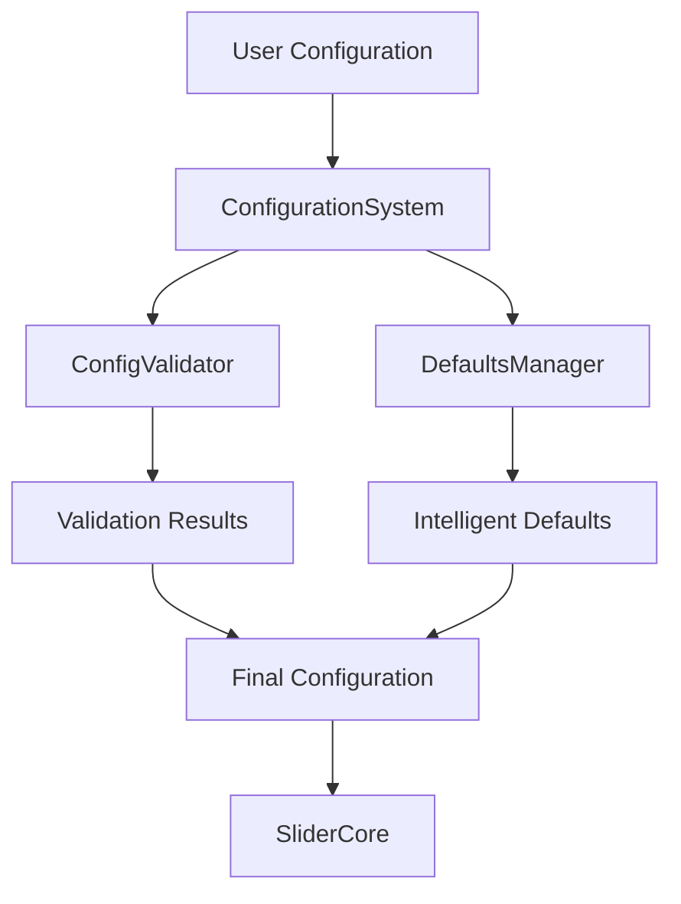

# KineticSlider Documentation

Comprehensive documentation for the KineticSlider component, featuring interactive guides, templates, and examples.

## 📚 Documentation Overview

This documentation suite provides everything you need to understand, configure, and implement KineticSlider in your projects.

### Available Documentation

| Document | Description | Best For |
|----------|-------------|----------|
| [**Configuration Guide**](./CONFIGURATION_GUIDE.md) | Complete guide to all configuration options | Learning the system architecture and options |
| [**Interactive Guide**](./interactive-configuration-guide.html) | Live configuration builder with real-time preview | Building configurations visually |
| [**Configuration Templates**](./configuration-templates.md) | Ready-to-use templates for common use cases | Quick implementation and reference |

---

## 🚀 Quick Start

### 1. Basic Implementation

```typescript
import { KineticSlider } from 'kinetic-slider';

const config = {
  slides: [
    { id: 'slide1', src: '/images/slide1.jpg' },
    { id: 'slide2', src: '/images/slide2.jpg' },
    { id: 'slide3', src: '/images/slide3.jpg' }
  ]
};

const slider = new KineticSlider();
await slider.initialize(config, document.getElementById('slider-container'));
```

### 2. Enhanced Implementation

```typescript
const advancedConfig = {
  slides: [
    { 
      id: 'slide1', 
      src: '/images/slide1.jpg',
      alt: 'Descriptive alt text',
      title: 'Slide Title'
    }
    // ... more slides
  ],
  autoPlay: true,
  autoPlayInterval: 4000,
  loop: true,
  accessibility: {
    screenReader: true,
    keyboardNavigation: true
  },
  responsive: {
    enabled: true,
    strategy: 'mobile-first'
  }
};
```

---

## 📖 Documentation Sections

### Configuration Guide ([View Full Guide](./CONFIGURATION_GUIDE.md))

**Complete reference covering:**
- ✅ System architecture and components
- ✅ All configuration options with examples
- ✅ Step-by-step configuration building
- ✅ Responsive design patterns
- ✅ Performance optimization techniques
- ✅ Accessibility compliance (WCAG 2.1 AA)
- ✅ Migration from legacy configurations
- ✅ Troubleshooting and validation
- ✅ Complete API reference

**Key Features:**
- 📊 Visual architecture diagrams
- 🔍 Detailed option explanations
- ⚡ Performance optimization guides
- ♿ Accessibility best practices
- 🛡️ Type safety with TypeScript
- 🔧 Troubleshooting section

### Interactive Configuration Builder ([Open Builder](./interactive-configuration-guide.html))

**Interactive features:**
- ✅ Real-time configuration preview
- ✅ Visual form-based configuration
- ✅ Live validation and error checking
- ✅ Tabbed interface for organized options
- ✅ Copy-paste ready configuration output
- ✅ Built-in configuration validator
- ✅ Responsive design examples
- ✅ Performance optimization guides

**Sections Include:**
- 🎯 Quick start examples
- 🛠️ Interactive configuration builder
- 📱 Responsive configuration patterns
- ⚡ Performance optimization examples
- 🔧 Configuration validator tool
- ⚠️ Common issues and solutions

### Configuration Templates ([View Templates](./configuration-templates.md))

**Ready-to-use templates for:**
- ✅ **Basic Templates** - Simple galleries and slideshows
- ✅ **E-commerce Templates** - Product showcases and banners
- ✅ **Portfolio Templates** - Photography and design portfolios
- ✅ **Marketing Templates** - Hero banners and testimonials
- ✅ **Accessibility Templates** - WCAG 2.1 AA compliant configurations
- ✅ **Performance Templates** - Optimized for large galleries and high-quality displays
- ✅ **Responsive Templates** - Mobile-first and desktop-first strategies
- ✅ **Advanced Templates** - Multi-media galleries and production configurations

**Template Categories:**
- 🖼️ **Image Galleries** - Basic to advanced gallery configurations
- 🛍️ **E-commerce** - Product showcases and category carousels
- 🎨 **Portfolios** - Professional portfolio presentations
- 📢 **Marketing** - Hero banners, testimonials, promotional content
- ♿ **Accessibility** - WCAG compliant configurations
- ⚡ **Performance** - Optimized for speed and memory efficiency
- 📱 **Responsive** - Mobile-first and desktop-first approaches
- 🚀 **Production** - Enterprise-ready configurations

---

## 🛠️ Configuration System Architecture

The KineticSlider configuration system consists of four main components:



### Core Components

1. **Type Definitions** (`SliderConfig`)
   - Comprehensive TypeScript interfaces
   - Full IntelliSense support
   - Hierarchical configuration structure

2. **Configuration Validation** (`ConfigValidator`)
   - Runtime validation with detailed error reporting
   - Performance warnings and best practice suggestions
   - Path-based error tracking

3. **Defaults Management** (`DefaultsManager`)
   - Context-aware intelligent defaults
   - Responsive defaults with breakpoint support
   - Smart merging algorithms

4. **Configuration System** (`ConfigurationSystem`)
   - Unified API: `processConfig(userConfig)`
   - Combines validation and defaults
   - Legacy configuration migration

---

## 🎯 Use Case Examples

### Simple Image Gallery
```typescript
const simpleGallery = {
  slides: [
    { id: 'img1', src: '/gallery/1.jpg', alt: 'Gallery image 1' },
    { id: 'img2', src: '/gallery/2.jpg', alt: 'Gallery image 2' },
    { id: 'img3', src: '/gallery/3.jpg', alt: 'Gallery image 3' }
  ]
};
```

### Auto-Playing Slideshow
```typescript
const slideshow = {
  slides: [...],
  autoPlay: true,
  autoPlayInterval: 5000,
  loop: true,
  pauseOnHover: true
};
```

### High-Performance Gallery
```typescript
const performanceGallery = {
  slides: largeSlideArray,
  enableVirtualization: true,
  preloadCount: 2,
  memoryManagement: {
    maxMemoryUsage: 256,
    autoGarbageCollection: true
  }
};
```

### Accessible Configuration
```typescript
const accessibleSlider = {
  slides: [...],
  accessibility: {
    screenReader: true,
    keyboardNavigation: true,
    ariaLabels: {
      sliderLabel: 'Product showcase',
      slideLabel: 'Product {index} of {total}'
    }
  }
};
```

---

## 📱 Responsive Configuration

### Mobile-First Strategy
```typescript
const mobileFirst = {
  slides: [...],
  // Base mobile configuration
  duration: 300,
  preloadCount: 1,
  
  responsive: {
    enabled: true,
    strategy: 'mobile-first',
    breakpoints: [
      {
        name: 'tablet',
        minWidth: 768,
        config: { preloadCount: 2 }
      },
      {
        name: 'desktop',
        minWidth: 1024,
        config: { preloadCount: 3 }
      }
    ]
  }
};
```

### Desktop-First Strategy
```typescript
const desktopFirst = {
  slides: [...],
  // Base desktop configuration
  autoPlay: true,
  preloadCount: 5,
  
  responsive: {
    enabled: true,
    strategy: 'desktop-first',
    breakpoints: [
      {
        name: 'mobile',
        maxWidth: 767,
        config: { 
          autoPlay: false,
          preloadCount: 1 
        }
      }
    ]
  }
};
```

---

## ⚡ Performance Optimization

### Large Gallery Optimization
```typescript
const largeGallery = {
  slides: generateSlides(500),
  enableVirtualization: true,
  preloadCount: 1,
  memoryManagement: {
    maxMemoryUsage: 128,
    autoGarbageCollection: true,
    cleanupThreshold: 0.5
  },
  rendering: {
    antialias: false,
    resolution: 1
  }
};
```

### High-Quality Display
```typescript
const highQuality = {
  slides: [...],
  memoryManagement: {
    maxMemoryUsage: 2048,
    textureCacheSize: 100
  },
  rendering: {
    antialias: true,
    resolution: Math.min(window.devicePixelRatio || 1, 3)
  }
};
```

---

## ♿ Accessibility Features

### WCAG 2.1 AA Compliance
```typescript
const accessibleConfig = {
  slides: [
    {
      id: 'slide1',
      src: '/images/slide1.jpg',
      alt: 'Detailed description of the image content',
      title: 'Slide Title',
      metadata: {
        description: 'Extended description for screen readers'
      }
    }
  ],
  accessibility: {
    screenReader: true,
    keyboardNavigation: true,
    reduceMotion: null,  // Auto-detect user preference
    highContrast: null,  // Auto-detect user preference
    ariaLabels: {
      sliderLabel: 'Image gallery',
      slideLabel: 'Image {index} of {total}: {title}. {description}',
      previousButton: 'Previous image',
      nextButton: 'Next image',
      playPauseButton: 'Play or pause slideshow'
    }
  },
  autoPlayInterval: 7000,  // Minimum 7 seconds per WCAG
  pauseOnHover: true,
  pauseOnFocus: true,
  pauseOnInteraction: true
};
```

---

## 🔧 Validation and Debugging

### Configuration Validation
```typescript
import { ConfigValidator } from 'kinetic-slider';

const validator = new ConfigValidator();
const result = validator.validateConfig(yourConfig);

if (!result.isValid) {
  console.error('Configuration errors:', result.errors);
  result.errors.forEach(error => {
    console.error(`${error.path}: ${error.message}`);
  });
}

if (result.warnings.length > 0) {
  console.warn('Configuration warnings:', result.warnings);
}
```

### Debug Mode
```typescript
const debugConfig = {
  slides: [...],
  debug: true,  // Enable detailed logging
  performance: {
    enabled: true,
    metrics: ['fps', 'memory', 'renderTime'],
    logging: true
  }
};
```

---

## 📊 Performance Monitoring

### Real-time Monitoring
```typescript
const slider = new KineticSlider();
await slider.initialize(config, container);

// Monitor performance events
slider.on('performance:warning', (data) => {
  console.warn('Performance warning:', data);
  
  // Automatic performance adjustments
  if (data.metric === 'memory' && data.value > 200) {
    slider.updateConfig({
      preloadCount: 1,
      memoryManagement: { maxMemoryUsage: 128 }
    });
  }
});

slider.on('performance:stats', (stats) => {
  console.log('Performance stats:', stats);
  // Send to analytics service
});
```

---

## 🔄 Migration Guide

### From Legacy Configuration
```typescript
// Old format
const legacyConfig = {
  images: ['/img1.jpg', '/img2.jpg'],
  transitionDuration: 500
};

// New format (automatically converted)
const newConfig = ConfigurationSystem.processConfig(legacyConfig);
// Results in:
// {
//   slides: [
//     { id: 'slide-0', src: '/img1.jpg' },
//     { id: 'slide-1', src: '/img2.jpg' }
//   ],
//   duration: 500
// }
```

---

## 🛡️ TypeScript Support

### Full Type Safety
```typescript
import { SliderConfig, KineticSlider } from 'kinetic-slider';

const config: SliderConfig = {
  slides: [
    { id: 'slide1', src: '/images/slide1.jpg' }
  ],
  duration: 300,  // TypeScript ensures this is a number
  autoPlay: true  // TypeScript ensures this is a boolean
};

const slider = new KineticSlider();
await slider.initialize(config, container);
```

---

## 📈 Best Practices

### Development
1. **Start Simple** - Begin with minimal configuration
2. **Use TypeScript** - Enable strict type checking
3. **Validate Early** - Use built-in validation
4. **Test Responsive** - Test all breakpoints
5. **Monitor Performance** - Enable performance monitoring

### Production
1. **Disable Debug** - Set `debug: false`
2. **Optimize Memory** - Configure memory management
3. **Enable Monitoring** - Track performance metrics
4. **Test Accessibility** - Verify WCAG compliance
5. **Handle Errors** - Implement error handling

---

## 🤝 Contributing

To contribute to the documentation:

1. Fork the repository
2. Create a feature branch
3. Make your changes
4. Test thoroughly
5. Submit a pull request

---

## 📄 License

This documentation is part of the KineticSlider project and follows the same license terms.

---

## 🔗 Additional Resources

- [GitHub Repository](https://github.com/your-username/kineticslider)
- [Live Examples](https://kineticslider-examples.netlify.app)
- [API Documentation](./API.md)
- [Contributing Guide](../CONTRIBUTING.md)

---

*Last updated: September 2023*
*Documentation version: 2.0.0*