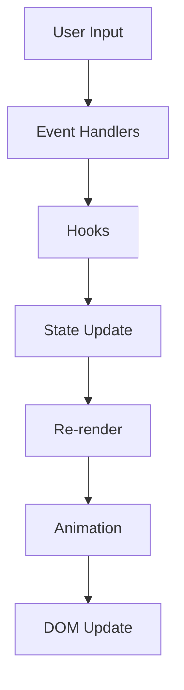

# KineticSlider Architecture

## Overview

KineticSlider is built with a modular architecture focusing on performance, accessibility, and maintainability. This document outlines the core architectural decisions and patterns used throughout the project.

## Core Components

### 1. Slider Core (`src/components/slider/`)
- **KineticSlider**: Main component handling slide rendering and state management
- **SlideContainer**: Manages slide layout and transitions
- **SlideControls**: Navigation and control interface
- **SlideContext**: React context for slider state

### 2. Hooks (`src/hooks/`)
- **useAnimation**: Animation state and GSAP integration
- **useKeyboard**: Keyboard navigation and shortcuts
- **useGesture**: Touch and mouse gesture handling
- **useSlideValidation**: Form validation for slide content
- **usePerformance**: Performance monitoring and optimization

### 3. Utilities (`src/utils/`)
- **animation**: GSAP animation utilities
- **validation**: Form and input validation
- **performance**: Performance tracking and optimization
- **accessibility**: ARIA and keyboard utilities
- **error**: Error handling and tracking

## State Management

### 1. Local Component State
- Per-slide state management
- Animation state
- Validation state

### 2. Context
- Global slider configuration
- Shared slider state
- Theme and styling

### 3. Props
- Component configuration
- Event handlers
- Custom renderers

## Data Flow

## Performance Optimizations

1. **Virtualization**
   - Dynamic slide loading
   - DOM element recycling
   - Memory management

2. **Animation**
   - GSAP for smooth animations
   - RAF scheduling
   - Hardware acceleration

3. **State Management**
   - Memoization
   - Selective re-rendering
   - Event debouncing

## Error Handling

1. **Validation**
   - Input validation
   - Props validation
   - State validation

2. **Error Boundaries**
   - Component-level error catching
   - Fallback UI
   - Error reporting

3. **Monitoring**
   - Performance metrics
   - Error tracking
   - Usage analytics

## Testing Strategy

1. **Unit Tests**
   - Component testing
   - Hook testing
   - Utility testing

2. **Integration Tests**
   - User flow testing
   - Event handling
   - State management

3. **E2E Tests**
   - Browser compatibility
   - Touch/mouse interaction
   - Accessibility

## Build and Deploy

1. **Build Process**
   - TypeScript compilation
   - Bundle optimization
   - Asset optimization

2. **Deployment**
   - Continuous Integration
   - Automated testing
   - Version management

## Security Measures

1. **Input Validation**
   - Type checking
   - Sanitization
   - Rate limiting

2. **Output Encoding**
   - XSS prevention
   - Content security
   - Safe HTML rendering

## Future Considerations

1. **Scalability**
   - Performance optimization
   - Feature expansion
   - API enhancement

2. **Maintenance**
   - Documentation updates
   - Dependency management
   - Security patches 